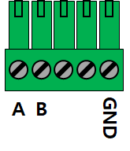
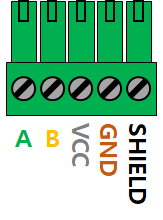

# Modbus Setup

Last Updated: Jan. 09, 2024

### Table of Contents

- [Modbus Address Range](#modbus-address-range)
- [MBControl Default](#mbcontrol-default)
- [PUSR Default](#pusr-default)
- [GA Default](#ga-default)
- [Renke Default](#renke-default)
- [Renke Wind Direction](#renke-wind-direction)
- [Renke Wind Speed](#renke-wind-speed)
- [Renke Ambient Temperature](#renke-ambient-temperature)
- [Renke Weather Station](#renke-weather-station)
- [Renke 4-20mA RS485](#renke-4-20ma-rs485)

---

# Modbus Address Range
### Total 1 ~ 247 (0x01 ~ 0xF7)
 - [01 ~ 30 (0x01 ~ 0x1E)] PV Inverter
 - [31 ~ 60 (0x1F ~ 0x3C] PV Temperature
 - [61 (0x3D)] GHI
 - [71 ~ 80 (0x47 ~ 0x50)] POA
 - 
 - [90 ~ 100 (0x5A ~ 0x64)] Structure Sensor
 - 
 - [200 (0xC8)] Wind Direction
 - [201 (0xC9)] Wind Speed
 - [202 (0xCA)] Ambient Temperature 

---

# MBControl Default

### Wire (LAPP 1032100)
<pre>
	White	Vcc
	Brown	GND
	Green	A+
	Yellow  B-
</pre>

---

# PUSR Default

3.81mm pitch 5P

---

# GA Default

3.50mm pitch 5P

---

# Renke Default
### 3 Way Cable:  
>    https://youtu.be/ZsB1V8zTqgs?t=33

### DC Power: 12V (10 ~ 30V dc)

### Wire
<pre>
	Brown	Vcc
	Black	GND
	Yellow	A+
	Blue    B-
</pre>

### Modbus-RTU
<pre>
  Default speed   4800bps
  Default address 0x01
</pre>

### Default Command

#### Version Number
- Register Address: 0x0009
- Function: 0x03
- Example: V2.04
<pre>
  Send: 01 03 0009 0001 [CRC]
  Receive: 01 03 02 02 04 [CRC]
</pre>

#### Modbus Address
- Register Address: 0x07D0
- Function: 0x06 / 0x03
- Example: Address = 0x00C8
<pre>
  Send: C8 06 07D0 00C8 [CRC]
  Receive: C8 06 07 D0 00 C8 [CRC] // Echo
</pre>

#### Query Modbus Address (0xFF)
- Register Address: 0x07D0
- Function: 0x03
- Example: Address = 0x003D
<pre>
  Send: FF 03 07D0 0001 [CRC]
  Receive: 3D 03 02 00 3D [CRC]
</pre>

#### Baud Rate 
- Register Address: 0x07D1
- Function: 0x06 / 0x03
- Content:
<pre><code> baud rate: 
	    0 – 2400bps
	    1 – 4800bps
	    2 – 9600 bps
	    3 – 19200bps 
</code></pre>

- Example: Baud = 9600 bps
<pre>
  Send: C8 06 07D1 0002 [CRC]
  Receive: C8 06 07 D1 00 02 [CRC] // Echo
</pre>

---

# Renke Wind Direction

- Register 0 : Wind direction 0 ~ 7
- Register 1 : Wind direction 0 ~ 360°

---

# Renke Wind Speed

- Register 0 : 10x Wind Speed value
- Example: Wind Speed = 2.9 m/s (0x1D = 29)
<pre>
  Send: C9 03 0000 0001 [CRC]
  Receive: C9 03 02 00 1D [CRC]
</pre>

---

# Renke Ambient Temperature

- Register 505 (0x01F9) : 10x Ambient Temperature
- Example: Ambient Temperature = 22.4°C (0xE0 = 224)
<pre>
  Send: CA 03 01 F9 00 01 [CRC] 
  Receive: CA 03 02 00 E0 [CRC]
</pre>
- Example: Ambient Temperature = -10.1°C (0xFF9B = -101)
<pre>
  Send: CA 03 01 F9 00 01 [CRC] 
  Receive: CA 03 02 FF 9B [CRC]
</pre> 

---

# Renke Weather Station

### Wind Speed
- Address: 01 (*)
- Baud: 4800 (*)

### Wind Direction
- Address: 02 (*)
- Baud: 4800 (*)

### Base Station
- Address: 01 --> 202 (0xCA)
- Baud: 4800 --> 9600

### Register Map
- 500 (0x1F4) : 10x Wind Speed
- 502 (0x1F6) : Wind Direction (0\~7)
- 503 (0x1F7) : Wind Direction (0\~360°)
- 504 (0x1F8) : 10x Humidity
- 505 (0x1F9) : 10x Ambient Temperature

---

# Renke 4-20mA RS485

- I/O : 4\~20mA / 655\~3276 (12bit)
- Register 0 : CH1
- Register 1 : CH2
- Example: Read CH1 (0x78A = 1930)
<pre>
  Send: 5A 03 00 00 00 01 [CRC] 
  Receive: 5A 03 02 07 8A [CRC] 
</pre>

---
